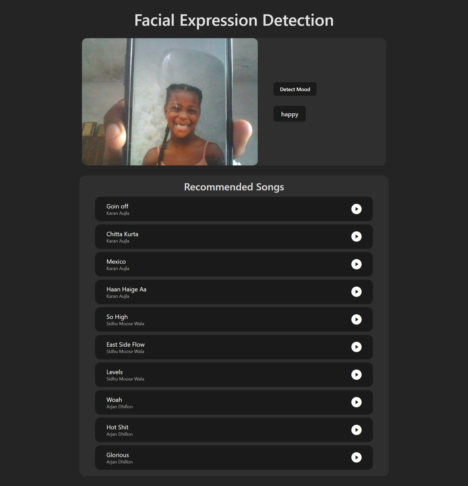
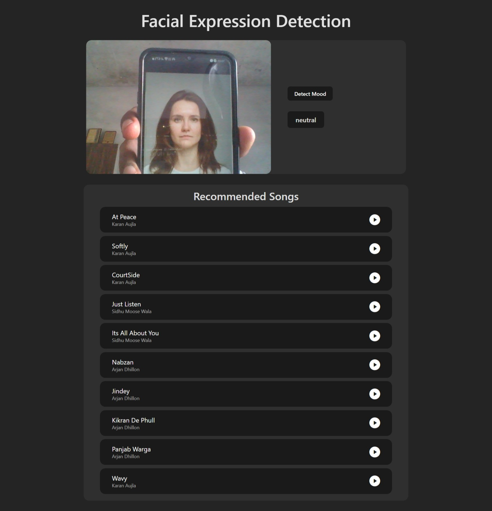
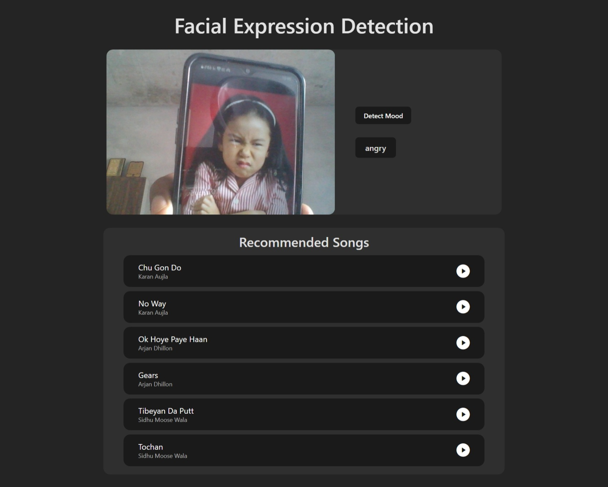

# 🎧 MoodSwinger – A Mood-Based Music Player

MoodSwinger is a smart web-based music player that detects your mood using facial expressions and plays music accordingly. Built with modern web technologies, it bridges the gap between emotion and music using AI-powered expression recognition.

---

## 🚀 Live Demo
👉 [Click here to try MoodSwinger](https://moodswinger.vercel.app/)

---

## 📸 Screenshots





---

## 🧠 How It Works

MoodSwinger uses your webcam (with permission) to detect facial expressions through the **face-api.js** library. Based on your mood — such as happy, sad, or neutral — it selects a playlist or track that matches the emotion from the backend.

---

## 🔧 Tech Stack

### Frontend
- [React.js](https://reactjs.org/)
- [face-api.js](https://github.com/justadudewhohacks/face-api.js)

### Backend
- [Node.js](https://nodejs.org/)
- [Express.js](https://expressjs.com/)

### Database
- [MongoDB](https://www.mongodb.com/)

---

## ✨ Features

- 🎭 Real-time mood detection via webcam using face-api.js
- 🎶 Music playback based on detected emotion
- 📁 Music stored in MongoDB, served via Node.js API
- 🔐 User privacy respected – camera access only with permission
- 📱 Responsive design (React.js frontend)

---

## 📦 Installation & Setup

### 1. Clone the repository

```bash
git clone https://github.com/Pardeep-Shyoran/Moody-Player.git
cd Moody-Player
```

### 2. Install dependencies for both frontend and backend

```bash
# Backend
cd Backend
npm install

# Frontend
cd ../Frontend
npm install
```

### 3. Environment setup

```bash
Create a .env file in both frontend and backend folders with appropriate configuration. Example:

# Backend (.env):

MONGODB_URL= *****
IMAGEKIT_PUBLIC_KEY= *****
IMAGEKIT_PRIVATE_KEY= *****
IMAGEKIT_URL_ENDPINT= *****

# Frontend (.env):

VITE_GET_SONGS_API_URL=http://localhost:{Port No.}/songs

```


### 4. Run the development servers

```bash
# Start backend server
cd Backend
npx nodemon server.js

# Start frontend dev server
cd ../Frontend
npm run dev
```

## 📁 Folder Structure
```
Moody-Player/
├── backend/
│   └── src, models, routes, db, etc.
├── frontend/
│   └── src, components, pages, etc.
├── screenshots/
│   └── *.png
```


---

## 🛡️ Privacy Notice

- Camera access is explicitly requested and never stored.
- No user data is sent to third-party services.

---

## 🤝 Contributing

Pull requests are welcome! For major changes, please open an issue first to discuss your ideas.

1. Fork the repository
2. Create your feature branch (`git checkout -b feature/YourFeature`)
3. Commit your changes (`git commit -m 'Add YourFeature'`)
4. Push to the branch (`git push origin feature/YourFeature`)
5. Open a pull request

---

## 📄 License

This project is **Open Source**.

---

## 📬 Contact

Made with ❤️ by [Pardeep Shyoran](https://www.linkedin.com/in/pardeepshyoran)  
Feel free to connect and share feedback!


